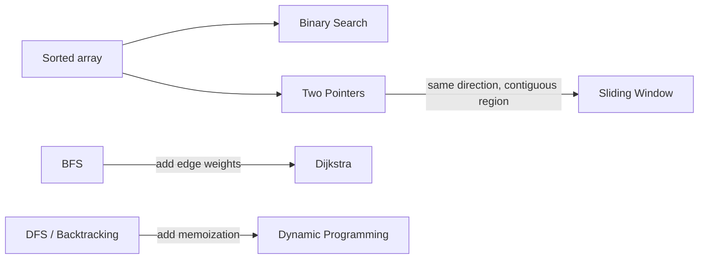

# The Decision Framework

You do not need to recognize the answer. You need to recognize the pattern. These are the questions to ask an unfamiliar problem, in order, before you write any code.

## 1. What is the shape of the input?
- **Sorted array?** Think Binary Search or Two Pointers.
- **Contiguous subarray or substring?** Think Sliding Window.
- **Tree or graph?** Think BFS or DFS.
- **Weighted graph, shortest path?** Think Dijkstra.
- **"Count the ways" or "min/max cost" over choices?** Think Dynamic Programming.

## 2. What is the question asking?
- **Shortest path, fewest steps, unweighted?** BFS.
- **All combinations, all paths, or does one exist?** DFS or Backtracking.
- **Longest or shortest window under a constraint?** Sliding Window.
- **A single optimal value built from smaller optimal values?** DP.

## 3. What is the brute force, and what is wasteful about it?
The pattern is usually the fix for a specific waste:
- Recomputing overlapping subproblems, use DP (memoize them).
- Re-scanning the same subarray, use Sliding Window (reuse the window).
- Scanning a sorted space linearly, use Binary Search (halve it).
- Checking every pair, use Two Pointers (move inward).

## 4. Is the answer space monotonic?
If "X works implies X+1 works" (or the reverse), you can binary search the answer even when the input is not a sorted array. This is how Koko Eating Bananas (LC 875) and Split Array Largest Sum (LC 410) become binary search.

## The 7 triggers at a glance
| If you see... | Reach for |
|---|---|
| Sorted array, find a pair or a target | Two Pointers / Binary Search |
| Contiguous window + "at most / longest / shortest" | Sliding Window |
| Unweighted shortest path or level order | BFS |
| All paths, all subsets, all permutations | DFS / Backtracking |
| Weighted shortest path, non-negative | Dijkstra |
| Overlapping subproblems + optimal substructure | Dynamic Programming |

## How the patterns relate
Several patterns are the same idea with one thing added. Seeing the links makes them easier to recall and to tell apart:

- **BFS is Dijkstra with every weight equal to 1.** The moment edges cost different amounts, BFS breaks and you need the heap.
- **DFS plus memoization is top-down DP.** If the same subproblem repeats across branches, cache it and the exponential search collapses.
- **Sliding Window is Two Pointers moving the same direction** over a contiguous region you aggregate, rather than closing in from both ends.

## See it run
The fastest way to internalize a trigger is to watch the pattern execute once. ▶ https://tryexpora.com/algorithm-debugger
