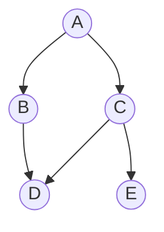

# Breadth-First Search (BFS)

## Trigger
Shortest path or fewest steps in an unweighted graph or grid, or anything that asks for a level-order traversal. If every move costs the same and you want the minimum number of moves, it is BFS.

## How it works
Explore in rings. Start from the source, visit all its neighbors, then all of theirs, and so on. A queue holds the frontier. Because BFS reaches nodes in order of distance, the first time it touches the target is guaranteed to be the shortest path. Mark nodes visited when you enqueue them, not when you dequeue, to avoid adding the same node twice.

## Diagram
BFS from `A` fans out level by level. Level 0 is the source, level 1 its neighbors, level 2 theirs:



## Template
```
queue = deque([start])
visited = {start}
steps = 0
while queue:
    for _ in range(len(queue)):     # one full level
        node = queue.popleft()
        if node == goal: return steps
        for nxt in neighbors(node):
            if nxt not in visited:
                visited.add(nxt)
                queue.append(nxt)
    steps += 1
```

## Worked example
Shortest path from `A` to `E` in the graph above. Each round drains one full level, so the level a node is reached on is its distance from the source.

| level | nodes reached | queue after the level |
|:---:|:---|:---|
| 0 | A | `[A]` |
| 1 | B, C | `[B, C]` |
| 2 | D, E | `[D, E]` |

`E` is first reached at level 2, so the shortest distance from `A` is **2** (A to C to E). Note `D` is discovered from `B` and then skipped when `C` sees it again, because it was already marked visited on enqueue.

## Classic problems
- Number of Islands (LC 200)
- Rotting Oranges (LC 994, multi-source)
- Word Ladder (LC 127)
- Binary Tree Level Order Traversal (LC 102)
- Shortest Path in Binary Matrix (LC 1091)

## Complexity
Time O(V + E). Space O(V) for the queue and the visited set.

## Common mistakes
- **Marking visited on dequeue instead of enqueue.** The same node then gets added several times, blowing up the queue and the runtime.
- **Not counting levels** when the question asks for a distance. Process the queue one full level at a time and increment steps per level.
- **Using BFS on a weighted graph.** Equal-cost steps are the whole premise; with different weights use Dijkstra.

## vs DFS
BFS finds the shortest path in unweighted graphs; DFS does not. Use BFS when the question is about distance or levels. Use DFS when the question is about existence, all paths, or going deep (connected components, cycle detection).

## See it run
Watch the queue drain level by level and the frontier expand ring by ring: ▶ https://tryexpora.com/algorithm-debugger
