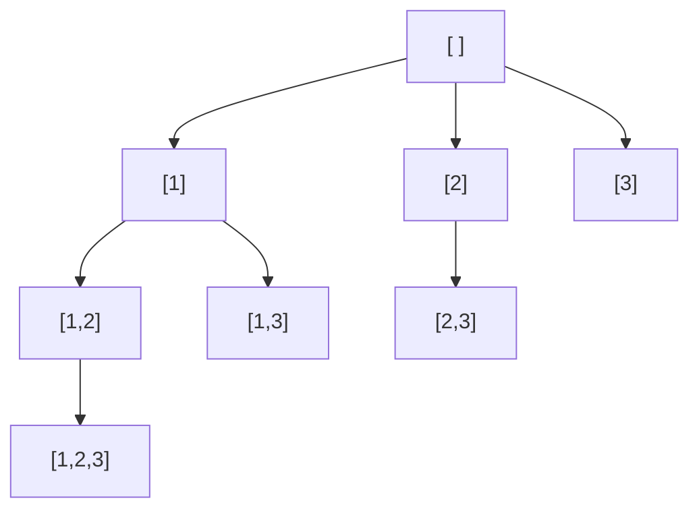

# DFS and Backtracking

## Trigger
You need to explore all paths, generate all subsets, permutations, or combinations, or answer "does any path exist". The signal is "all", "every", or a decision tree where each step chooses and may need to undo.

## How it works
Depth-first search commits to a choice, recurses, and comes back. Backtracking adds the undo: choose, explore, un-choose. That un-choose is the whole trick. It restores the state so the next branch starts clean. Every backtracking problem is the same three lines around a recursive call.

## Diagram
Building every subset of `[1, 2, 3]` by only ever adding a larger element. Each node is a valid subset and the tree is the search space:



## Template (backtracking)
```
def backtrack(path, choices):
    if is_complete(path):
        results.append(path.copy())
        return
    for choice in choices:
        path.append(choice)                     # choose
        backtrack(path, next_choices(choice))   # explore
        path.pop()                              # un-choose
```

## Worked example
Generating all subsets of `[1, 2]`. Watch the path grow and shrink as the algorithm chooses, records, and un-chooses:

| action | path | recorded |
|:---|:---:|:---|
| start | `[ ]` | `[ ]` |
| choose 1 | `[1]` | `[1]` |
| choose 2 | `[1,2]` | `[1,2]` |
| un-choose 2 | `[1]` | |
| un-choose 1 | `[ ]` | |
| choose 2 | `[2]` | `[2]` |
| un-choose 2 | `[ ]` | |

Result: `[ ], [1], [1,2], [2]`. The `un-choose` step is what lets the same `path` variable serve every branch. Without it, `[2]` would come out as `[1,2]` because the 1 was never removed.

## Pruning
N-Queens is Subsets with one extra line: before recursing, skip any choice that already violates a constraint. Pruning does not change the worst case, but it makes exponential problems tractable in practice.

## Classic problems
- Subsets (LC 78)
- Permutations (LC 46)
- Combination Sum (LC 39)
- N-Queens (LC 51)
- Word Search (LC 79)

## Complexity
Time O(branches^depth), exponential by nature. Space O(depth) for the recursion stack plus the current path.

## Common mistakes
- **Forgetting to un-choose.** State leaks into sibling branches and the output is wrong.
- **Recording a reference to `path` instead of a copy.** Every result then points at the same list, which ends up empty.
- **No pruning on constrained problems.** N-Queens and Sudoku are intractable without cutting invalid branches early.
- **Wrong base case,** so recursion records nothing or never terminates.

## vs BFS and DP
Use DFS over BFS when you need all paths or existence, not the shortest one. When the same subproblem repeats across branches, add memoization and DFS becomes top-down dynamic programming.

## See it run
Watch the decision tree grow, the path push and pop, and pruning cut whole branches: ▶ https://tryexpora.com/algorithm-debugger
