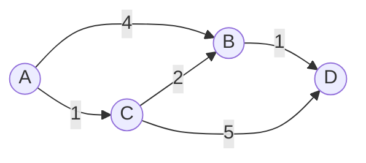

# Dijkstra's Algorithm

## Trigger
Shortest path in a weighted graph with non-negative edge weights. BFS is not enough because edges cost different amounts; you cannot count steps, you must sum weights.

## How it works
Greedily expand the closest unvisited node. A min-heap keyed by distance always hands you the nearest frontier node. When you pop a node, its shortest distance is final. Relax each neighbor: if going through the current node is cheaper, update the neighbor's distance and push it. Non-negative weights are what make "the popped node is final" true; negative edges break that, so use Bellman-Ford there.

## Diagram
Weighted graph. The shortest path from `A` to `D` is not the fewest edges but the smallest total weight:



A to C to B to D costs 1 + 2 + 1 = 4, cheaper than A to B to D (5) or A to C to D (6).

## Template
```
dist = {start: 0}
heap = [(0, start)]
while heap:
    d, node = heappop(heap)
    if d > dist[node]: continue          # stale entry
    for nxt, w in neighbors(node):
        nd = d + w
        if nd < dist.get(nxt, inf):
            dist[nxt] = nd
            heappush(heap, (nd, nxt))
```

## Worked example
Shortest paths from `A` in the graph above. The min-heap always returns the nearest unfinished node; when a node is popped its distance is final. `dist` starts at 0 for `A`, infinity elsewhere.

| pop (dist, node) | relaxations | dist after |
|:---|:---|:---|
| (0, A) | B: 0+4=4, C: 0+1=1 | A0, B4, C1 |
| (1, C) | B: 1+2=3 < 4 update, D: 1+5=6 | A0, B3, C1, D6 |
| (3, B) | D: 3+1=4 < 6 update | A0, B3, C1, D4 |
| (4, B) stale | 4 > dist[B]=3, skip | unchanged |
| (4, D) | no cheaper neighbor | final |

Final distance from `A` to `D` is **4**. The stale `(4, B)` entry is the price of a lazy heap: instead of updating a node in place you push a fresh entry and skip the outdated one when it surfaces.

## Classic problems
- Network Delay Time (LC 743)
- Cheapest Flights Within K Stops (LC 787, Dijkstra variant)
- Path With Minimum Effort (LC 1631)
- Swim in Rising Water (LC 778)

## Complexity
Time O((V + E) log V) with a binary heap. Space O(V).

## Common mistakes
- **Negative edge weights.** Dijkstra assumes a popped node is final, which negative edges break. Use Bellman-Ford instead.
- **Not skipping stale heap entries.** Check `if d > dist[node]: continue` right after popping.
- **Marking a node final when you push it** instead of when you pop it. The final distance is only known at pop time.
- **Trusting the result on a graph you did not verify** is non-negative.

## vs BFS
Use BFS when every edge costs the same (it is Dijkstra with all weights equal to 1). Reach for Dijkstra the moment weights differ. If weights can be negative, neither works; use Bellman-Ford.

## See it run
Watch the heap hand you the nearest node and the distances relax one edge at a time: ▶ https://tryexpora.com/algorithm-debugger
